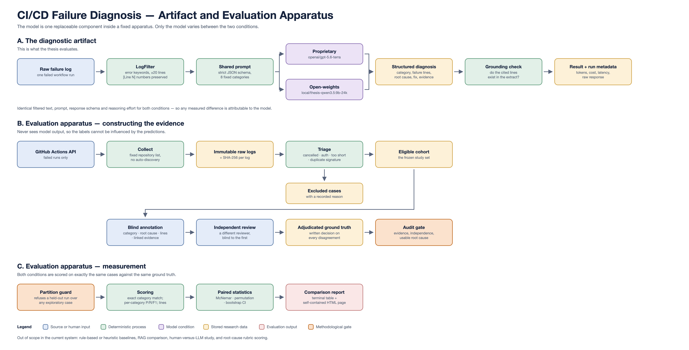

# Controlled Thesis Study Runbook

This is the operational guide for the single supported repository workflow:
the fresh, controlled final-study dataset.



## Purpose and safety boundary

The controlled workflow enforces the following order:

```text
protocol → preflight → collection → triage → cohort freeze
         → blind annotation → five-log pilot → final paired experiment
         → scoring and thesis outputs
```

Ground truth must be created with `automated_scripts/annotate_blind.py`, which
never loads or displays model output.

## Current implementation status

| Phase | Status | Entry point |
|---|---|---|
| Study protocol | Ready | `configs/thesis_fresh_2026.yaml` |
| Offline and live preflight | Ready | `automated_scripts/preflight_study.py` |
| Immutable collection | Ready | `automated_scripts/data_collection.py --study-config ...` |
| Auditable triage | Ready | `automated_scripts/triage.py --study-config ...` |
| Blind ground-truth annotation | Ready | `automated_scripts/annotate_blind.py` |
| Five-log paired pilot | Ready after ground truth | `automated_scripts/benchmark_models.py --pilot` |
| Final paired experiment | Ready after pilot approval | `automated_scripts/benchmark_models.py` |

## Fixed study design

The versioned protocol is
[`configs/thesis_fresh_2026.yaml`](../configs/thesis_fresh_2026.yaml). It fixes:

- six repositories across Python, JavaScript/TypeScript and JVM ecosystems;
- no automatic repository discovery;
- at most 15 downloaded failures per repository;
- a maximum of 90 raw logs;
- a target of 50–70 eligible logs;
- minimum log length of 20 lines;
- at most two matching error signatures per repository;
- immutable raw records and recorded exclusion reasons.

Do not modify this protocol after collection starts. If the design must change,
create a new `study_id` and collect a separate dataset.

## Prerequisites

From the repository root:

```bash
source .venv/bin/activate
python --version
```

Expected Python version: 3.12 or newer.

The `.env` file must contain a valid GitHub token:

```env
GITHUB_TOKEN=github_pat_your_token
```

Later model phases also require:

```env
OPENAI_API_KEY=your_openai_key
```

The local condition requires Ollama and `gpt-oss:20b`, but neither is required
for collection or triage.

## Phase 1: preflight

Run the offline checks first:

```bash
python automated_scripts/preflight_study.py \
  --study-config configs/thesis_fresh_2026.yaml
```

The checks must confirm:

- Python version;
- valid study protocol structure;
- configured GitHub token;
- unused final output path;
- sufficient disk space;
- declared target equals the repository total.

Then perform the isolated one-log GitHub check:

```bash
python automated_scripts/preflight_study.py \
  --study-config configs/thesis_fresh_2026.yaml \
  --live
```

Expected outputs:

```text
data/studies/_preflight_thesis_fresh_2026/
├── sample_log.json
└── preflight_report.json
```

This smoke-test run ID is automatically excluded from the final cohort.

### Preflight gate

Do not start collection unless every offline check passes and the live check
downloads one complete log. `HTTP 401 Bad credentials` means the token in
`.env` must be replaced.

## Phase 2: collect and triage

The recommended command performs installation checks, preflight, collection
and triage in the controlled study mode:

```bash
./run_workflow.sh --skip-install
```

The workflow intentionally exits after triage. Annotation and model execution
remain explicit human-controlled phases.

To run the phases individually:

```bash
python automated_scripts/data_collection.py \
  --study-config configs/thesis_fresh_2026.yaml

python automated_scripts/triage.py \
  --study-config configs/thesis_fresh_2026.yaml
```

Expected study files:

```text
data/studies/thesis_fresh_2026/
├── study_protocol.yaml
├── collection_manifest.json
├── checksums/
│   └── log_content_sha256.json
├── raw/
│   └── logs.json
├── triaged/
│   └── eligible_logs.json
├── excluded/
│   └── excluded_logs.json
└── triage_manifest.json
```

### Collection gate

Inspect the collection manifest:

```bash
jq '{status, total_logs_collected, unique_repositories, collection_shortfalls, collection_errors}' \
  data/studies/thesis_fresh_2026/collection_manifest.json
```

Continue only when:

- the status is `complete`, or every warning is understood and documented;
- the raw count is plausible for the fixed protocol;
- all six repositories are represented, unless a shortfall is explicitly
  accepted before annotation;
- there are no unexplained authentication or download errors;
- the checksum file contains one entry per raw log.

### Triage gate

Inspect the eligible and excluded counts:

```bash
jq 'length' data/studies/thesis_fresh_2026/raw/logs.json
jq 'length' data/studies/thesis_fresh_2026/triaged/eligible_logs.json
jq 'group_by(.reason) | map({reason: .[0].reason, count: length})' \
  data/studies/thesis_fresh_2026/excluded/excluded_logs.json
```

Continue only when:

- every raw `log_id` appears exactly once in either eligible or excluded data;
- every exclusion has a recorded reason;
- approximately 50–70 eligible logs remain, or a deviation is justified;
- no repository dominates the cohort unexpectedly;
- the raw dataset remains unchanged.

## Recovery and reruns

Resume a genuinely interrupted collection:

```bash
./run_workflow.sh --from 2 --resume
```

Run only triage on an existing raw study:

```bash
./run_workflow.sh --from 3
```

The workflow preserves an existing triage result. Replace derived triage files
only when there is a documented methodological reason:

```bash
./run_workflow.sh --from 3 --overwrite-triage
```

Never overwrite a completed raw collection. A materially different collection
or selection protocol requires a new study identifier.

## Phase 3: freeze and back up the cohort

After the collection and triage gates pass:

1. Record the accepted raw and eligible counts.
2. Record any accepted repository shortfalls.
3. Copy the entire `data/studies/thesis_fresh_2026/` directory to a separate
   backed-up location.
4. Retain `collection_manifest.json`, `triage_manifest.json` and all checksum
   files with the backup.
5. Do not tune prompts, filters or selection rules against the final cohort.

The `data/studies/` directory is intentionally ignored by Git because it may
contain large public logs. Git is not the dataset backup.

## Phase 4: blind annotation

Run the blind annotation tool only after the cohort has been accepted and
backed up:

```bash
make annotate ANNOTATOR=your-stable-id
```

The tool:

- read `triaged/eligible_logs.json` directly;
- display the log and GitHub context without any model output;
- assign the approved failure category;
- record the actual root cause and supporting lines;
- checkpoint after every annotation;
- store annotator, timestamp and annotation-schema version;
- preserve the exact `log_id` values from the frozen cohort;
- write to `ground_truth/ground_truth.json`.

Do not run either model on the final cohort before this blind ground truth is
complete and validated.

### Annotation gate

Before the pilot, verify:

- annotation count equals eligible-log count;
- there are no duplicate or missing `log_id` values;
- every category is from the fixed taxonomy;
- every annotation contains an actual error type, root cause and evidence;
- ambiguous cases are flagged rather than silently guessed.

## Phase 5: model readiness

The paired experiment uses:

```text
Proprietary:  openai/gpt-5.6-terra
Open-weights: local/gpt-oss:20b
Reasoning:    medium for both
```

Verify local availability:

```bash
ollama --version
ollama list
ollama show gpt-oss:20b --verbose
```

The benchmark records the resolved model information, Ollama metadata, prompt
hash, input hash, schema, Git commit, token use, cost and run date.

## Phase 6: five-log paired pilot

After blind annotation and model readiness pass:

```bash
python automated_scripts/benchmark_models.py \
  --input data/studies/thesis_fresh_2026/triaged/eligible_logs.json \
  --ground-truth data/studies/thesis_fresh_2026/ground_truth/ground_truth.json \
  --pilot \
  --output-dir data/studies/thesis_fresh_2026/experiments/pilot_001
```

### Pilot gate

Do not run the full cohort until:

- both models attempted the same five `log_id` values;
- all expected structured fields were parsed;
- evidence line numbers can be traced to the filtered log;
- failures and raw responses are preserved;
- model identities and Ollama digest/quantization are recorded;
- token, cost and execution-time metadata are populated;
- no prompt or schema change remains necessary.

If the prompt, schema, filtering behavior or reasoning configuration changes,
discard the pilot outputs and run a new numbered pilot.

## Phase 7: final paired experiment

After pilot approval, lock the configuration and run:

```bash
python automated_scripts/benchmark_models.py \
  --input data/studies/thesis_fresh_2026/triaged/eligible_logs.json \
  --ground-truth data/studies/thesis_fresh_2026/ground_truth/ground_truth.json \
  --output-dir data/studies/thesis_fresh_2026/experiments/final_001
```

Do not reuse the pilot directory. If a run is interrupted, reuse the same
final output directory so the benchmark can resume from its per-model
checkpoints.

Expected experiment artifacts include:

```text
run_metadata.json
results_openai_gpt-5.6-terra.json
results_local_gpt-oss_20b.json
comparison_report.json
statistical_tests.json
cost_accuracy_tradeoff.png
```

## Final verification checklist

- [ ] The study protocol was fixed before collection.
- [ ] The preflight sample is absent from the final cohort.
- [ ] Raw-log and configuration checksums are preserved.
- [ ] Exclusion reasons account for every removed log.
- [ ] The final cohort was annotated blind.
- [ ] Pilot and final experiments use separate directories.
- [ ] Both conditions use identical inputs, prompt, schema and reasoning level.
- [ ] Requested and resolved model identifiers are recorded.
- [ ] Every failed inference remains in the result files.
- [ ] Reported thesis values are generated from the preserved final outputs.

The repository no longer contains the legacy API, RAG, human-study,
model-visible annotation or demonstration-evaluation paths. All supported
commands now operate on the controlled study design described here.
