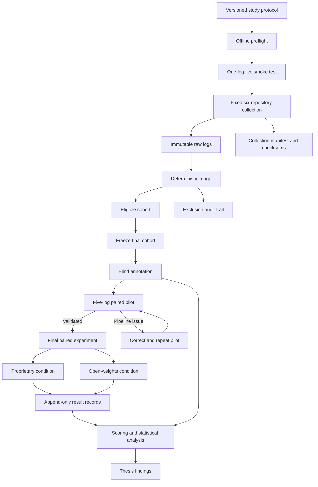

# CI/CD Diagnosis Architecture

This document is the canonical architecture view for the thesis project. It
separates dataset construction, the diagnostic system under evaluation, and
the research evaluation process.

## Current end-to-end dataflow

```mermaid
flowchart LR
    A[GitHub Actions API] --> B[data_collection.py]
    B --> C[Raw workflow logs<br/>immutable JSON]

    C --> D[triage.py]
    D --> E[Eligibility and deduplication]
    E --> F[Eligible study cohort]
    D --> X[Excluded cases<br/>with reasons]

    F --> G{Execution path}
    G -->|Operational API| H[FastAPI /diagnose]
    G -->|Thesis experiment| I[benchmark_models.py]

    H --> J[Deterministic LogFilter]
    I --> J
    J --> K[Relevant lines<br/>with original line numbers]
    K --> L[Shared prompt and JSON schema]

    L --> M[Proprietary model]
    L --> N[Open-weights model]
    M --> O[Structured diagnosis]
    N --> O

    O --> P[Grounding verifier]
    P --> Q[Evidence validation<br/>and grounding score]
    Q --> R[Predictions and run metadata]

    S[Blind human ground truth] --> T[Evaluation]
    R --> T
    U[Rule-based baselines] --> T

    T --> V[Overall effectiveness]
    T --> W[Model comparison]
    T --> Y[Failure-category analysis]
    T --> Z[Statistics, tables and figures]
```



The model is a replaceable component. The evaluated artifact is the complete
diagnostic system: filtering, model inference, structured output and evidence
grounding.

## Controlled thesis dataflow



## Storage and lineage

```text
data/studies/thesis_fresh_2026/
├── study_protocol.yaml
├── collection_manifest.json
├── checksums/
│   └── log_content_sha256.json
├── raw/
│   └── logs.json
├── triaged/
│   └── eligible_logs.json
├── excluded/
│   └── excluded_logs.json
├── triage_manifest.json
├── ground_truth/
└── experiments/
```

Every derived record must remain traceable to its immutable raw log through
`study_id`, `log_id`, GitHub run ID and SHA-256 checksum. The isolated preflight
run is automatically excluded from the final collection.

## Thesis boundary

Included in the evaluated system:

- deterministic log filtering;
- model-based diagnosis;
- shared structured output;
- evidence grounding;
- proprietary versus open-weights model condition.

Supporting research infrastructure:

- GitHub collection and triage;
- blind annotation;
- baselines, scoring and statistical analysis.

Currently outside the main thesis scope:

- RAG comparison;
- human-versus-LLM user study;
- production monitoring and dashboards;
- additional model families or prompt-condition experiments.

